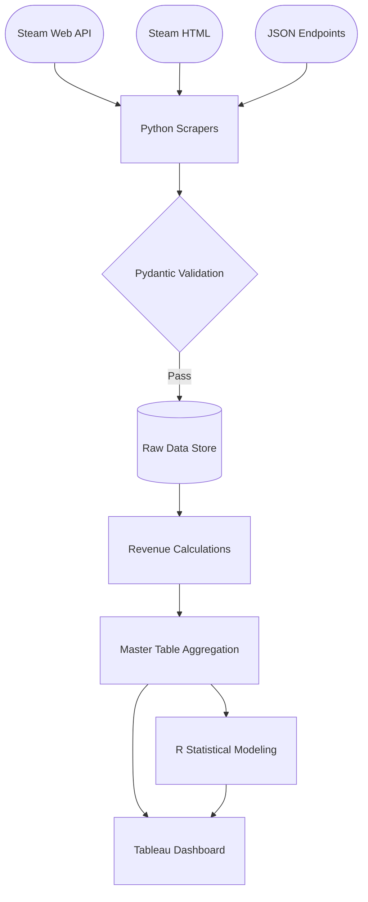

# Steam Analytics Dashboard
**Repository for Georgia Tech's CSE 6242 DVA Project - Spring 2026 Team 40**

# ℹ️ Description
This project serves as a comprehensive analytics solution developed during the Spring 2026 semester for Georgia Tech’s CSE 6242 (Data and Visual Analytics).

**Our mission:** to empower indie developers, small game studios, and researchers on the world’s largest gaming platform by bridging the gap between academic research and actionable analytics through an intuitive and interactive dashboard.

**Key Features:**
- **Mass & Resilient Data Ingestion:** Engineered to collect data from the official [Steamworks Web API](https://steamcommunity.com/dev), internal JSON endpoints, and raw HTML scraping from the [Steam website](https://store.steampowered.com/) while managing rate limits and connection stability..

- **Scale:** Manages metadata and complex schemas for 200K+ App IDs and 100K+ Games.

- **Advanced Modeling:** Implements the Boxleiter Method for revenue estimation and Linear Regression for sales prediction.

- **End-to-End Integrity:** Utilizes Pydantic for schema validation and type uniformity while ensuring full reproducibility across all collection, transformation, and visualization layers.

# 🏗️ Data Architecture


# 🛠️ Tech Stack
- **Languages:** Python (Scraping & ETL), R (Statistical Modeling)

- **Data Handling:** Requests (HTTP Requests), BeautifulSoup (HTML Parsing), Pydantic (Schema Validation), Pandas (Data Manipulation)

- **Visuals:** Tableau

- **Environment:** venv, renv

# 💾 Installation
### 0. Prerequisites
- Python 3.14+
- R version 4.5.2+
- CLI

### 1. Setup
#### Clone Repository:
```Bash
git clone https://github.com/USER/Steam-Analytics-Dashboard
cd Steam-Analytics-Dashboard
```

#### Environment Configuration:
Creating a virtual environment is highly recommended to manage dependencies:
```Bash
python3 -m venv .venv
source .venv/bin/activate # On Windows: .venv\Scripts\activate
```

### 2. Installing Dependencies
#### Python:
- Production: ```python3 -m pip install .```
- Development: ```python3 -m pip install -e .```

#### R:
- CLI: ```Rscript -e "renv::restore()"```
- RStudio: ```R renv::restore()```

### 3. API Configuration
- Obtain a key from the [Steam Web API Documentation](https://steamcommunity.com/dev).
- Open the ```config.env``` and update the ```API_KEY``` field.

# 🚀 Execution
### 0. Data Ingestion (Scrapers)
We recommend starting with the metadata scraper, as it populates the core App ID registry.

> **Note:** Due to rate-limiting and dataset size, these scripts may require several days for a full refresh.

```Bash
# Core metadata ingestion
python3 -m Scrapers.appdetails_scraper

# Supporting data streams
python3 -m Scrapers.appreviews_scraper
python3 -m Scrapers.currentplayers_scraper
python3 -m Scrapers.tags_scraper
python3 -m Scrapers.achievements_scraper
```

### 2. Data Transformations and Algorithms
#### Revenue Estimations
Calculates revenue using the **Boxleiter Method**, using the following logic: \
$$
\text{Revenue} \approx (\text{Reviews} \times \text{Multiplier}) \times \text{Price}
$$
```Bash
python3 -m Transformers.revenue
```

#### Feature Engineering & Modeling
Aggregates the master data table, performs one-hot encoding for categorical variables, and executes the regression model.
```Bash
# Data aggregation and encoding
python3 -m Transformers.master

# Train and test Linear Regression models
Rscript Algorithms/units_regression.R
```

# 📊 Dashboard Demo
https://github.com/user-attachments/assets/3fda41e6-61f5-406a-b0e1-0025d5b01a8d
